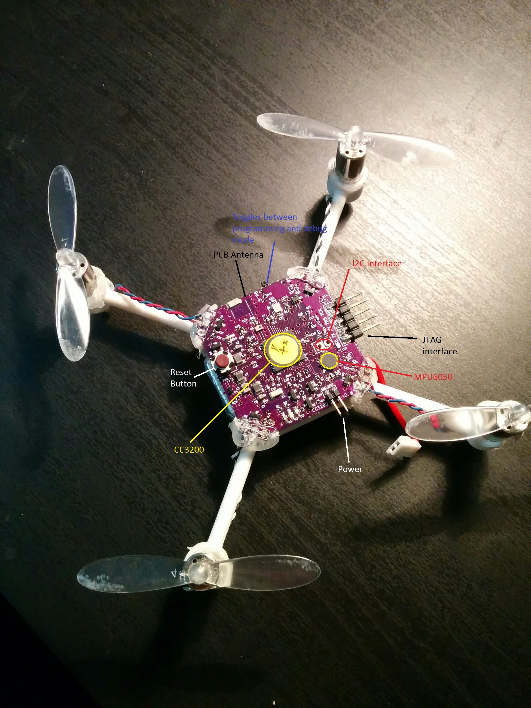
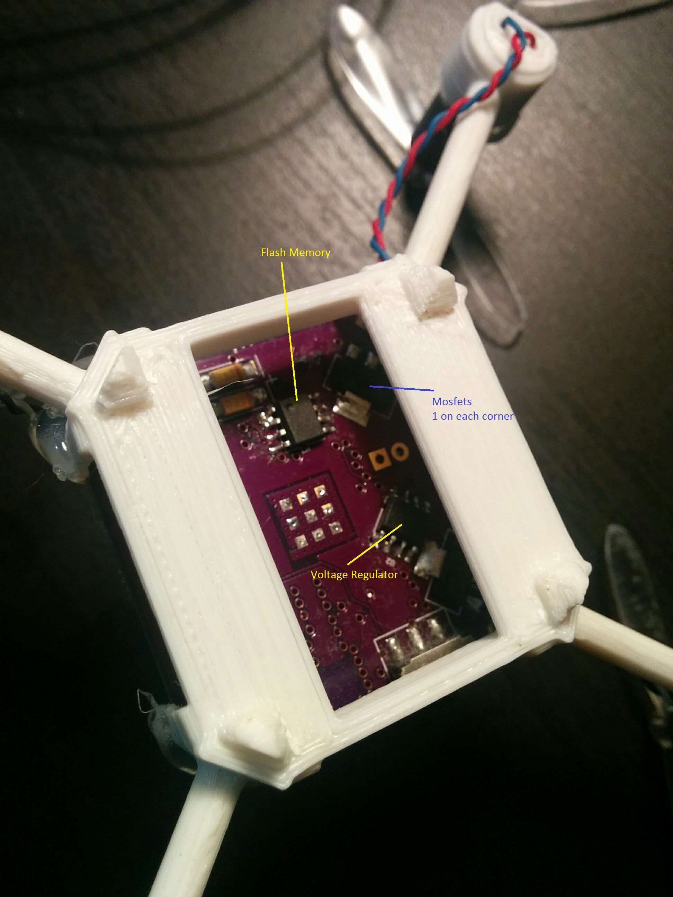
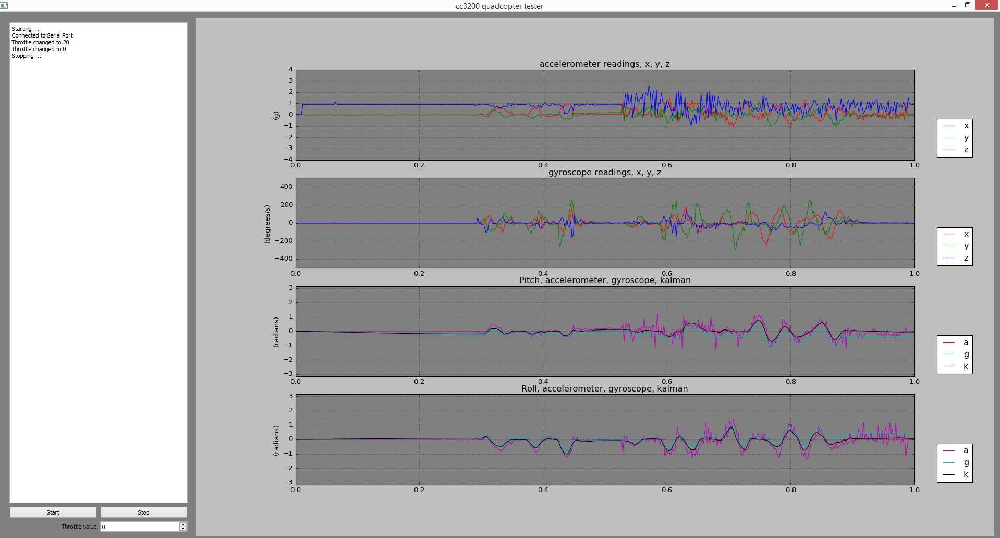

# cc3200 quadcopter
a small quadcopter based on TI [CC3200](http://www.ti.com/product/cc3200) Wifi Processor

This is a project I started to develop a small quadcopter that I can control through my smartphone. It began as the idea: "wouldn't it be cool to fly a quadcopter with my phone?". Soon after, I got a development board for the CC3200 platform and I enrolled on a year-long journey of hw/sw development.

[Here's a video of it flying](https://youtu.be/NUO0UMu_Gpo)

[Here's a video of making Wifi connection through a smartphone](https://youtu.be/c3Ppp-kUkaQ)

Most "cotrol" related components are routed to the top of the PCB. The board measure 4cm x 4cm and contains 4 copper layers.

While "Power" related components are routed to the bottom. Note that there are 4 Mosfets placed in each corner, one for each DC motors.

While developing the sw, I also made a simple PyQt app for visualizing the measured and calculated sensor readings from the quadcopter. This "tester" app, as I call it, was important for developing Kalman filter for accelerometer and gyroscope readings.

