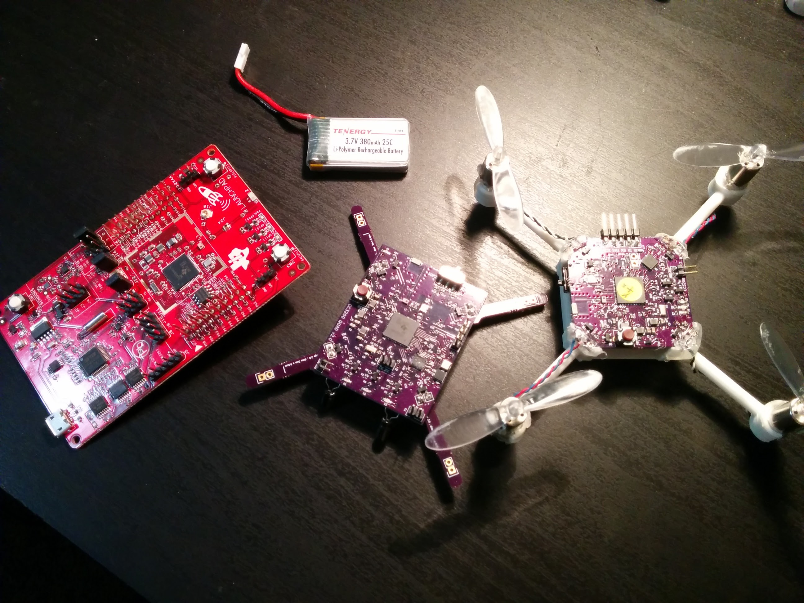

# cc3200 quadcopter
a small quadcopter based on TI [CC3200](http://www.ti.com/product/cc3200) Wifi Processor

This is a project I started to develop a small quadcopter that I can control through my smartphone. It began as the idea: "wouldn't it be cool to fly a quadcopter with my phone?". Soon after, I got a development board for the CC3200 platform and I enrolled on a year-long journey of hw/sw development.

#Connecting to Smartphone

#Flight Video

Most "control" related components are routed to the top of the PCB. The board measure 4cm x 4cm and contains 4 copper layers.

While "Power" related components are routed to the bottom. Note that there are 4 MOSFETs placed in each corner, one for each DC motors.

While developing the sw, I also made a simple PyQt app for visualizing the measured and calculated sensor readings from the quadcopter. This "tester" app, as I call it, was important for developing Kalman filter for accelerometer and gyroscope readings.

Here's picture showing the "evolution" of this quadcopter. On the left we have the original CC3200 development board, on which my board designs were based. In the middle is the first version of the PCB. It was functional, but had several shortcomings that motivated me to develop another version. On the right, you see the final version with much smaller PCB mounted on a chasis that I made on SolidWorks and printed out using a local 3D printer.

